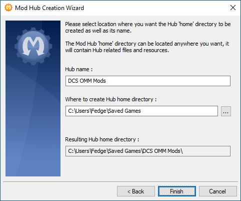

# One Actual Mods

[Open Mod Manager](https://github.com/sedenion/OpenModMan) is a tool that allows you to manage downloading, installing, and uninstalling mods for any game or program. It is the successor to OvGME and is a lot more flexible and powerful. It is free and open source.

* [Download OMM](#omm-download-link)
* [Initial Setup](#initial-setup)
* [Downloading and Installing Mods](#downloading-and-installing-mods)
* [Advanced OMM Features](#advanced-omm-features)

## OMM Download Link

Download the latest release of OMM from the link below, and install it.

[Latest OMM Release](https://github.com/sedenion/OpenModMan/releases/latest)

---

## OMM Repository URLs
Listed below are the URLs for One Actual's OMM repos. [Detailed instructions below](#step-4-connect-to-the-one-actual-mod-repository)

| Repository | Base address                 | Name      |
| ---------- | ---------------------------- | --------- |
| Default    | `http://one-actual.com/mods` | `default` |
| Legacy     | `http://one-actual.com/mods` | `legacy`  |
| Extras     | `http://one-actual.com/mods` | `extras`  |

* The "Default" repository is required by default for all of One Actual's missions.
* The "Legacy" repository is required for some of our older missions and training environments. The mods included in this repo haven't been updated by their authors in a while, and will not be included or required for new missions.
* The "Extras" repository is purely optional, and contains mods that are just "for fun." You are *not* required to add this repo, nor are you required to download/install any of these mods.

---

## Initial Setup

Before you can connect to the One Actual mod repository and start downloading mods, you'll need to perform a few one-time, initial setup tasks in OMM.

#### STEP 1: Create a new "Mod Hub" for DCS
> A "mod hub" is just a collection of settings specific to a single game (like DCS).

1. Navigate to **File** > **New** > **Mod Hub ...**
	> The "Mod Hub Creation Wizard" will appear
2. Click **Next**

#### STEP 2: Configure the DCS "Mod Hub"
> OMM supports modding any game, so this name will be specific to your DCS mods. This will be the name and path of the folder where OMM stores all its files specific to DCS. You can choose any name and any path you want.

1. Enter a **Hub name**
	- Recommended name: `DCS OMM Mods`
2. Choose a path for the modd hub
	- Recommended path: `C:\Users\<you>\Saved Games`
	- This is where all the mods will be downloaded and stored.
3. Click **Finish**

#### STEP 3: Create a new "Channel"
> A "channel" refers to a specific location where mods will be installed. We'll need to create a channel that points to the DCS Saved Games folder, which is where we need to install our mods. You can name the channel anything you want, but the channel's "target path" must be set correctly.

A popup window should appear, asking you whether you want add a new channel. Click **Yes**. If this window doesn't appear, you can get there by navigating to **Hub** > **Add Channel**.

1. Click **Next >** on the channel creation wizard
2. Enter a **Channel title**
	- Recommended title: `DCS-SavedGames`
3. Set the **Modding target directory** to point to your DCS Saved Games folder
	- Target path: `C:\Users\<you>\Saved Games\DCS`
	- (or, wherever your DCS saved games folder actually lives)

4. Click **Next >**

5. Leave the two checkboxes unchecked, unless you specifically want to change where OMM stores your mods.

6. Click **Finish**

You should now see your "DCS-SavedGames" channel, and your OMM window should like this:

#### STEP 4: Connect to the One Actual mod repository
> One Actual makes our mods available for download at our website. We need to configure OMM to look for our mods manifest so it can retrieve the list of mods available for download.

1. Click on the **Network Library** tab near the top of the OMM window.

2. Add a new repository by clicking on the small green `|+|` button on the left side of the repositories window.
	> The "Repository Configuration Wizard" window will appear.

3. Click **Next >**

4. Enter One Actual's **Repository address**, then click **Next >**
	- **Base address**: `http://one-actual.com/mods`
	- **Name**: `default`

5. OMM will attempt to connect to the repository and download the mods list. (You can also click the **Send query** button)
	> You should see a few lines appear in the text box below that indicate whether or not you successfully connected to the mods repository.

6. If you get the message "_Repository appears valid_", then click the **Finish** button.
	> The One Actual mods repo is now configured and you can check for updates.

#### STEP 5: Done with initial setup
> The initial setup of OMM is now complete, and shouldn't have repeat these steps ever again.

- You can proceed to [downloading and installing](#downloading-and-installing-mods) the mods.

---

## Downloading and Installing Mods

#### STEP 1: Refresh the One Actual mods repository
> Refreshing the mods repo will allow you to check for new mods, or updates to existing mods. You can refresh as frequently as you'd like.

1. Refresh the One Actual mods repo:
	- Click the small _circular arrow_ button on the left side of the repositories window.
	—— or ——
	- Double-click the repository in the repositories list.

2. OMM should download our mods list and show you all the mods available for download.

**Status Symbols:**

- A new mod, ready for download:

	

- A mod that has already been downloaded:

	

- A mod that has an update available:

	

#### STEP 2: Download Mods
1. Double click a mod to download it.
—— or ——
Shift-click multiple mods in the list and click the **Download** button to download multiple mods at the same time.

	> Once mods are downloaded, they will receive a green checkmark.

#### STEP 3: Install Mods
1. Click on the **Library** Tab at the top of the OMM window.
	> This will show you all the mods in the currently selected OMM channel's library folder. This includes all the mods you just downloaded, in addition to any mods that you have manually moved into your `C:\Users\<you>\Saved Games\OMM-DCS\DCS-SavedGames\Library` folder.

2. Double click a mod to install it.
—— or ——
Shift-click multiple mods in the list and click the **Install** button to install multiple mods at the same time.

	> Once installed, a green checkmark will appear next to the mod name.

#### Uninstalling Mods
You can uninstall mods exactly the same way you installed them: Double click the mod, or select multiple mods and click the **Uninstall** button. OMM will remove these mods from your DCS Saved Games folder, but the mod will still be in your OMM-DCS library folder. You can reinstall it at anytime, without having to redownload it.

You can install/uninstall mods quickly and easily depending on what mods are required for whatever DCS game servers you fly on.

## Auto-open Your DCS Hub

You can set OMM to automatically load your DCS mod hub when it starts.

1. Navigate to **Edit** > **Manager options**

2. Check the "Open Mod Hub at startup" option

3. Select the mod hub you created above.
	> It's probably at `C:\Users\<you>\Saved Games\DCS OMM Mods\hub.omx`

4. Click **Apply**

---

## Advanced OMM Features

##### Scripts
You can create a script that will install a specific subset of mods. For example, if you want to be able to easily install _only_ those mods that are required by our Syria Training map, you can create a new script that will install only the required mods, and will uninstall any extra mods.

##### Additional Channels
You can create additional channels that will install mods to a location other than `C:\Users\<you>\Saved Games\DCS`. For example, if you have some mods that are required to be installed in the main DCS `Program Files` folder, you can create a new channel and set the channel's "Target Path" to wherever you have DCS installed. This can be very useful for re-installing custom mods that get wiped out everytime DCS is updated.

##### Creating and Editing Mod Packages
_(TODO)_
